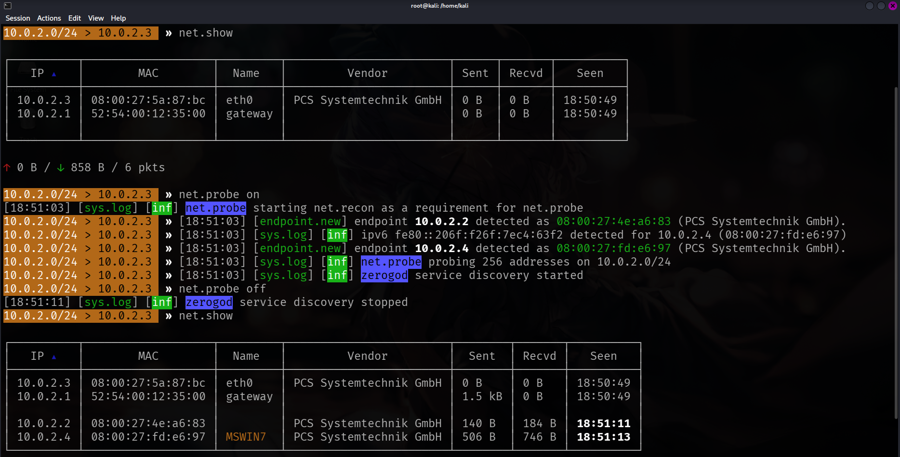
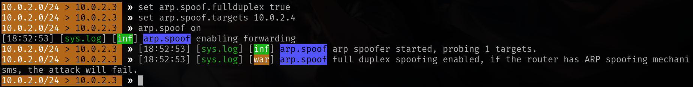
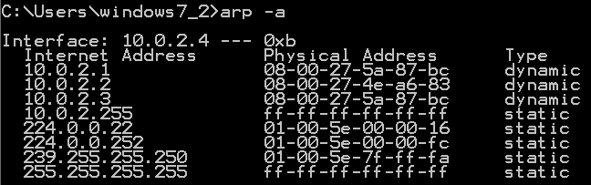
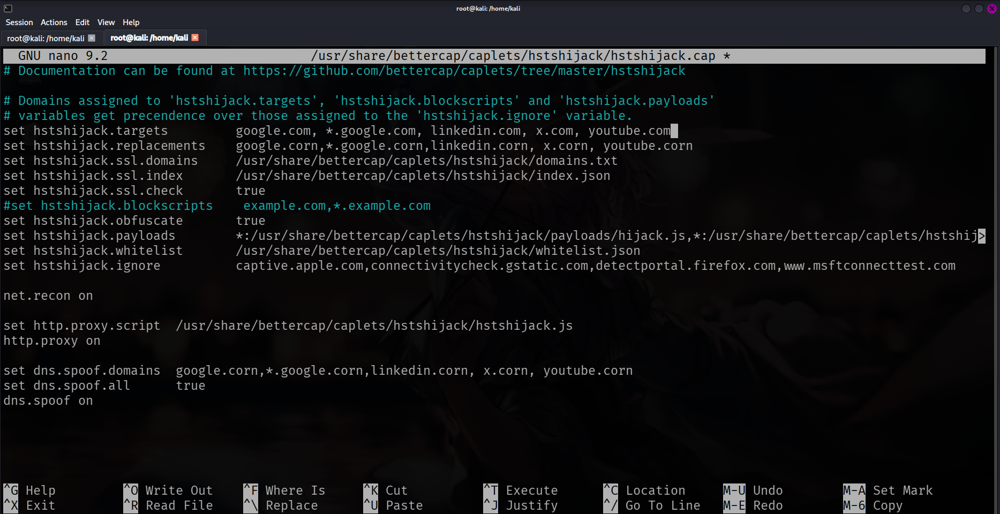
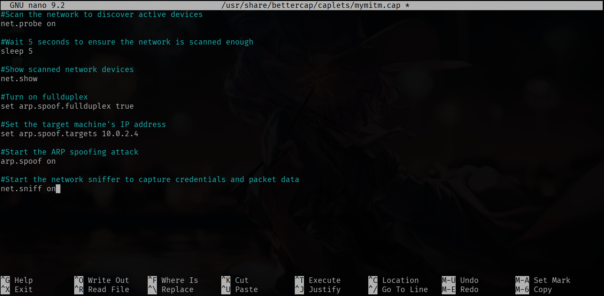
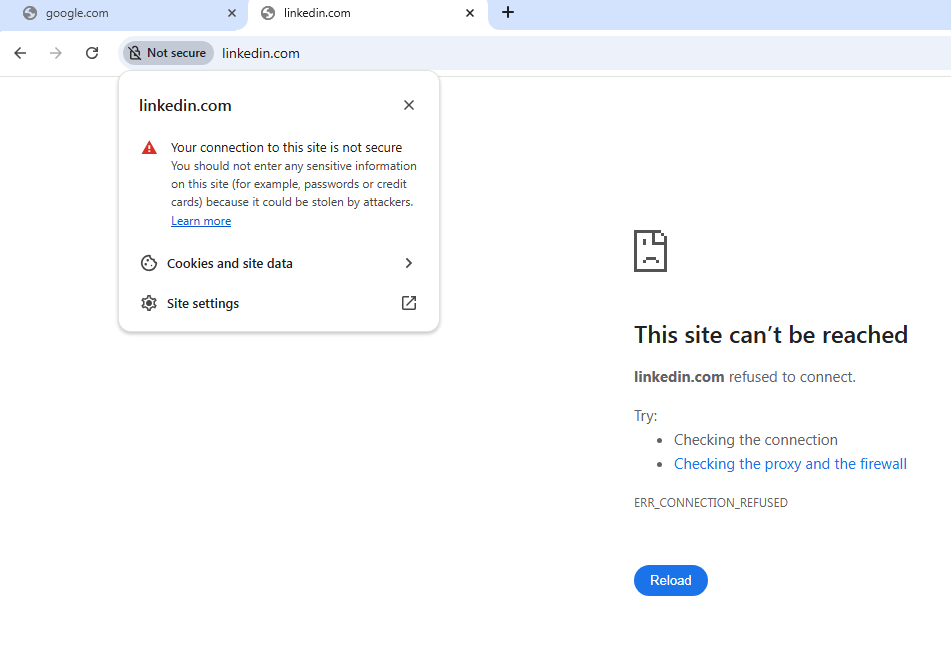

# MITM Automation with Bettercap and HTTPS Downgrade

> [!WARNING]
> This project was conducted in an isolated lab environment (Kali Linux + Windows VM).
> All techniques demonstrated here are for **educational purposes only**.
> Never perform these attacks on networks or devices you do not own or have explicit permission to test.

[Read the full write-up on Medium](https://medium.com/@amesysia/mitm-automation-with-bettercap-and-https-downgrade-4f6def6801d5)

In my previous write-up, I performed an MITM attack manually. Today, I’ll explain how I automated that process using Bettercap.

Bettercap is a powerful tool for MITM attacks. It has built-in network discovery and ARP spoofing modules. We don’t have to set IP forwarding manually because Bettercap handles it for us automatically.

I’ll explain the modules and parameters I’ll be using beforehand.
`net.probe`: It sends dummy UDP packets to discover active devices on the network.
`net.show`: This is Bettercap’s version of `netdiscover`. It shows us IP addresses, MAC addresses, and even device hostnames.
`net.sniff`: This acts like a lightweight Wireshark. Instead of capturing every single packet, it filters the traffic and shows only the important ones. I turned this on after starting the spoof to capture credentials.

`arp.spoof.fullduplex`: When set to true, both the target and the gateway will be spoofed. I set its value to true because a complete MITM attack requires tricking both sides. If we don’t spoof the gateway, we won’t be able to see the responses coming back to the target.
`arp.spoof.targets`: This specifies our target’s IP address. While you can attack multiple targets by separating IPs with commas, it is not recommended since it makes the attack unstable and easier to detect. I set it to a single target.

I needed to be root since Bettercap requires direct access to the network interface to send and intercept packets. I typed `sudo su` to become root, then started a Bettercap session with eth0 as our interface:

```
bettercap -iface eth0
```

First, I checked if Bettercap could see my Windows machine.



It didn’t detect the Windows machine at first. Once I turned `net.probe` on, it captured Windows’ IP and MAC addresses, and hostname.

I set the parameters and I was ready to start spoofing.

```
set arp.spoof.fullduplex true
set arp.spoof.targets 10.0.2.4
arp.spoof on
net.sniff on
```



I checked Windows to see if the gateway and Kali had the same MAC address.



In my previous attack, I captured credentials easily because the target site used HTTP. This time, I wanted to spice things up a little bit and try an HTTPS downgrade attack. To achieve this, I used a caplet called “hstshijack”. A caplet is just a script of Bettercap commands. It automates the attack, so we don’t have to type everything one by one. (You can use `caplets.show` to see caplets installed on your Bettercap.)

The hstshijack caplet is made to bypass HSTS (HTTP Strict Transport Security). HSTS is a security rule that forces web browsers to only use HTTPS. It stops any attempt to drop the connection down to HTTP. To counter this, hstshijack uses a technique called SSL stripping. If you go to the caplet's folder and look at its files, you can actually see the SSL strip codes trying to catch the secure connection and turn it into standard HTTP.

First, I configured the hstshijack file. For this, I opened another tab in this terminal by clicking Session in the top left corner, then typed:

```
sudo nano /usr/share/bettercap/caplets/hstshijack/hstshijack.cap
```



What this script does is turn .com into .corn, since ‘rn’ looks like ‘m’ in the URL bar. This way, the user thinks they’re on the real site while actually visiting a fake domain with no HTTPS protection, making it possible to intercept their traffic.
I added sites such as LinkedIn, X, and YouTube.

I typed `hstshijack`, pressed Tab to let Bettercap auto-complete the caplet path, then hit Enter. But there was a problem: It gave me an error saying “net.recon already running”. I turned `net.recon` off and tried again. It worked, but I still wanted to understand why that error happened in the first place.

I tried searching Google for answers, but apparently, no one else had experienced my specific problem. Someone in a forum comment suggested upgrading Bettercap, so I tried to upgrade the package, only to find out it was already on the newest version. Eventually, Google’s AI suggested that I configure the hstshijack.cap file and turn the `net.recon on` line into a comment line.

It worked, but typing the exact same configurations over and over again while troubleshooting gave me an idea. If caplets are scripts meant to prevent typing the same lines repeatedly, why not write my own custom caplet?

I opened a new tab in the terminal and typed:

```
sudo nano /usr/share/bettercap/caplets/mymitm.cap
```



```
#Scan the network to discover active devices
net.probe on

#Wait 5 seconds to ensure the network is scanned enough
sleep 5

#Show scanned network devices
net.show

#Turn on fullduplex
set arp.spoof.fullduplex true

#Set the target machine's IP address
set arp.spoof.targets 10.0.2.4

#Start the ARP spoofing attack
arp.spoof on

#Start the network sniffer to capture credentials and packet data
net.sniff on
```

I tested my custom `mymitm` caplet to set up the spoof and it worked like a charm. Then I executed `hstshijack`. I went to my Windows machine and tested several sites. I typed google.com, linkedin.com, x.com, and youtube.com in the URL bar. All of them loaded fine and the connection remained secure. So the downgrade attack failed.

I tried configuring the hstshijack file one more time. I changed the value of `hstshijack.obfuscate` to false. Obfuscation hides the injected JavaScript from detection. Turning it off was a troubleshooting step to check whether it was causing the failure. I ran `bettercap` and `hstshijack` again but it didn’t work either.

So I tried a new caplet for hstshijack. I typed the command below in the terminal and downloaded it from GitHub:

```
wget https://github.com/atilsamancioglu/hstshijackcaplet/archive/refs/heads/master.zip
```
Because I was going to change the files inside, I ran:

```
sudo rm -rf /usr/share/bettercap/caplets/hstshijack/*
```

This ensured all the old files and folders were deleted. Then, I found the downloaded master.zip file in /home/kali, renamed it using the command `mv master.zip hstshijack.zip` and then extracted it:

```
sudo unzip /home/kali/hstshijack.zip -d /usr/share/bettercap/caplets/hstshijack/
```

However, when I tried to run it in Bettercap, it failed. I realized that the contents in the zip file extracted into a subfolder called hstshijack-master instead of directly into the caplets directory, which caused Bettercap to not recognize the path. I quickly fixed this by moving the files to the correct location using the `mv` command and deleting the extra folder with `rm -rf`.

I ran Bettercap again, started my custom `mymitm` caplet first, typed `hstshijack`, and pressed Tab. Bettercap successfully auto-completed the path this time and executed the caplet without any errors. This new hstshijack caplet included more target sites and configurations.

I tested several sites like Google, LinkedIn, X, and Apple. The connection showed as “Not secure”, which meant the downgrade was partially working. However, none of the pages actually loaded. Instead, the browser displayed a “This site can’t be reached” error.



I tried clearing all browser data, turning off built-in protection settings, and disabling ‘Secure DNS’, but the result was the same.

Even though I managed to downgrade the connection on some sites, the pages still didn’t load. This is because modern browsers have multiple layers of protection beyond just HTTPS, including HSTS preloading and strict security policies. This showed me that while these attacks were effective a few years ago, browsers have evolved to counter them.
